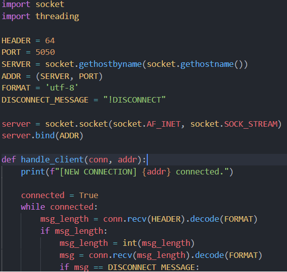
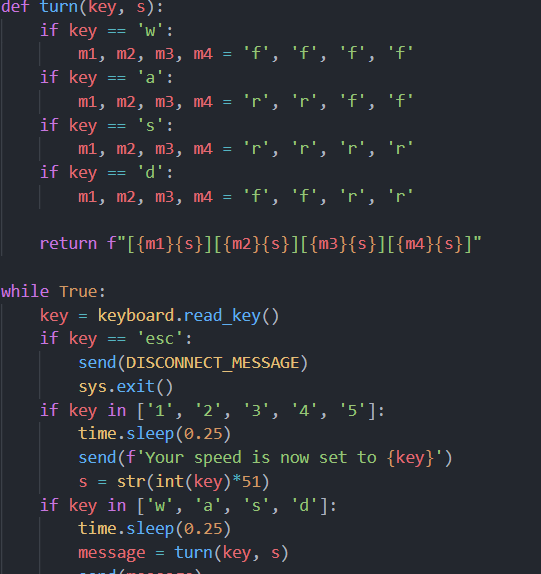

# R3-SoftwareTask2-VenkataramananGuruPrasad

### For my input I used keyboard. In addition, The client will only work if it is the same as the server i.e. both files are opened on the same device etc. If a different client needs to be accessed, then the SERVER constant in `key.py` can be changed to the desired IP of the server. Similarly, if port 5050 is not available it may need to be changed to the appropriate port. 

I first started by working on the server and getting it to connect with the client. 

Next, I used the keyboard module to take input and perform the required actions on it to get output.

Lastly, I put both together to get the final output. One challenge I faced was collecting input, as pynput may not work as well as keyboard since it has more conditions etc. Therefore, I went with the basic keyboard module, as pygame requires another screen which would be excessive.

This program works by transmitting information to a server from a client. The client-side takes care of all the calculations and just sends the final output to the server.

[Link to my video](https://youtu.be/ooBzuQd1arA)
